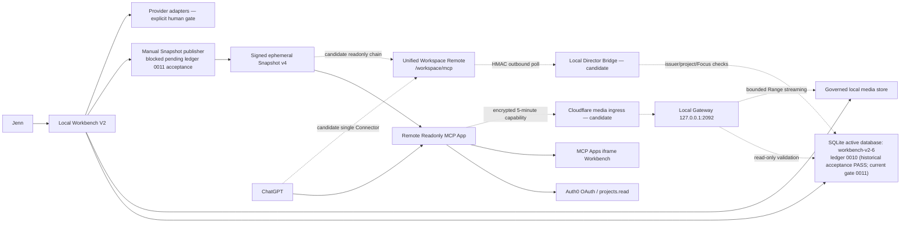

# Architecture

Status: `SCHEMA_GATE_PENDING`; current code requires ledger `0011`, while the active database remains at the historically accepted ledger `0010`
Accepted package: `0.1.0-beta.5`

## System map

Solid lines describe the intended operating paths, not currently authorized runtime actions. The active database completed the authorized `0010` migration with backup, manifest, `db:check` and restore evidence, but current code adds the controlled Artifact import-receipt schema and requires `0011`. Therefore `0010` is historical evidence only: startup, Snapshot publish, renewal and recovery remain blocked until a separately authorized `0011` migration and bounded runtime/publish re-acceptance pass. Dashed media lines are implemented but not yet externally accepted end to end.

## Sources of truth

| State | Authority | Persistence |
|---|---|---|
| Projects, SHOTs, reviews, delivery, authorization | Local SQLite | Durable, backed up before migration |
| Artifact bytes | Local governed media roots | Durable local files plus Blob integrity records |
| ChatGPT view | Signed readonly Snapshot | One in-memory copy on Remote Runtime |
| Playback capability/session | Local Gateway memory | 5-minute single-use capability / max 30-minute session |
| OAuth identity | Auth0 | External identity only; local membership remains authorization authority |

The Remote Runtime, ChatGPT Widget and Cloudflare are never authoritative business stores. The Unified Workspace Remote is also non-authoritative: it combines the signed Snapshot read chain with a bounded outbound bridge; it does not attach SQLite or retain local paths.

## Authority model

| Surface | Allowed | Forbidden |
|---|---|---|
| Workbench | Human confirmation, cost acknowledgement, Provider execution, review adoption, assembly, delivery and manual publish | Bypassing confirmation, secret or database gates |
| Readonly MCP App | Seven model-visible readonly tools, strict DTOs, signed Snapshot reads | Writes, Provider calls, media directory access, anonymous data |
| Unified Workspace candidate | Snapshot reads plus bounded Director Focus/context/frame analysis and immutable advisory Proposal submission through the local bridge | Approval, Grant compilation, Provider calls, Clip adoption, delivery, memory commit, direct SQLite access |
| Widget-only media tool | Request one project/artifact-bound capability | Returning playback URL to model content or bypassing membership |
| Local Media Gateway | Revalidate DB/Blob/file identity and stream approved bytes | Directory listing, arbitrary paths, writes, Provider operations |
| Provider adapters | Execute an already-authorized operation | Choosing authority or concealing uncertain submission outcome |

## Key invariants

1. SQLite opens read-only for projection and Gateway authorization checks.
2. Every public project/SHOT/Artifact object is cross-bound to its containing IDs.
3. Shared derived operational state is computed once and projected consistently into list, context, review and Snapshot DTOs.
4. Snapshot fingerprint is JCS SHA-256; signature and version are verified before atomic replacement.
5. OAuth identity alone grants nothing. The current issuer-bound principal needs an active local production-project membership.
6. Media playback requires Snapshot binding, active membership, Blob ownership, approved root containment and byte digest agreement.
7. Runtime secrets use external secret storage or DPAPI CurrentUser and never enter Git, command lines, status output or model-visible results.
8. Readiness means required dependencies for that profile are usable; `/healthz` only means process liveness.

## Runtime profiles

- `Workbench`: local operator UI on `127.0.0.1:4181`.
- `WebGPT readonly`: local MCP on `127.0.0.1:2091`, six data tools, no media listener.
- `WebGPT full`: explicit legacy/local profile with 14 tools; not externally accepted.
- `Remote Readonly App`: database-free OAuth MCP + Apps UI + signed Snapshot receiver.
- `Unified Workspace Remote`: candidate database-free `/workspace/mcp` connector; independent Readonly Snapshot and Director Bridge chains, with legacy `/mcp` retained for rollback.
- `Director Local Bridge`: candidate outbound-only process; it validates issuer/principal/project/Focus locally and writes only immutable advisory Proposals.
- `Readonly Media Gateway`: local `127.0.0.1:2092`, candidate external media path.

## Deployment boundaries

- Local Workbench and data stay on Jenn's Windows machine.
- Remote App currently uses Render Free characteristics: process memory can disappear after sleep/restart and has no persistent business store. The former manual Snapshot republish path is historical evidence; current-code republish remains blocked pending the `0011` gate.
- `aivideo.skmt617.top` is the MCP/App origin.
- The accepted `/mcp` route remains the rollback surface while candidate `/workspace/mcp` awaits its own OAuth, Bridge, Render and ChatGPT App acceptance. The two routes must not share an OAuth resource/audience or Snapshot store.
- `media.skmt617.top` is reserved for the Cloudflare media route; it is not accepted until instance-bound health and playback pass.
- Windows Scheduled Task installation remains a separate authorization gate.

For operational procedures use [USER_GUIDE.md](USER_GUIDE.md) and [DEPLOYMENT_GUIDE.md](DEPLOYMENT_GUIDE.md), not historical taskbooks.
