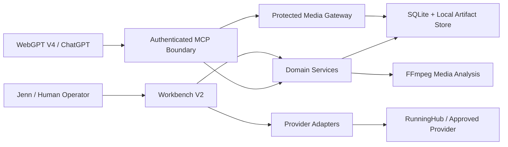

# Architecture

## System boundary



## Authority model

| Surface | Allowed | Forbidden |
|---|---|---|
| Workbench | Human confirmation, cost acknowledgement, Provider execution, review decisions, assembly and delivery | Bypassing confirmation or secret boundaries |
| WebGPT V4 | Production reads, limited SHOT copy edits, non-decision notes, proposals, unconfirmed intent preparation | Provider submit, cost confirmation, review adoption, delivery and deletion |
| Provider adapters | Execute an already authorized provider operation and return sanitized state | Selecting authority or silently retrying an unknown submit |
| Storage/media | Persist governed local truth and serve authorized artifacts | Exposing raw paths, private payloads or unscoped media |

## Stabilization target

The repository remains one deployable unit. During `0.1.0-beta.1`, active code is separated under `src/apps` and `src/packages` while preserving a single package and build graph. Historical execution material moves to a non-compiled `legacy/` evidence boundary.

Runtime target:

```text
Workbench app
  -> V2 HTTP/API composition
  -> domain/storage/provider/media packages
  -> persistent SQLite generation worker

WebGPT app
  -> OAuth-protected MCP
  -> scoped domain services
  -> protected media gateway
```

External Auth0, secure tunnel, public HTTPS media origin and Windows automatic startup are explicitly outside this stabilization release.

