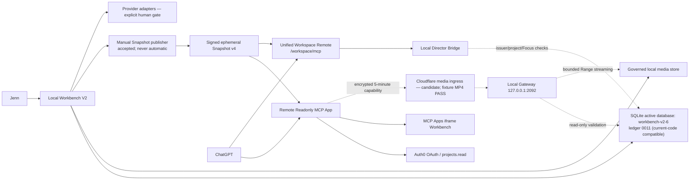

# Architecture

Status: `UNIFIED_TRANSPORT_AND_SCHEMA_PASS`; active database is at ledger `0011`, the bounded Unified Director owner path is accepted, and an isolated Media Gateway MP4 fixture playback/Range path has passed. Broader Provider, Memory, Media and multi-user gates remain separate.
Accepted package: `0.1.0-beta.5`

## System map

```mermaid
flowchart LR
    J["Jenn"] --> W["Local Workbench V2"]
    W --> DB["SQLite active database: workbench-v2-6\nledger 0011 (current-code compatible)"]
    W --> FS["Governed local media store"]
    W --> PA["Manual Snapshot publisher\naccepted; never automatic"]
    PA --> SS["Signed ephemeral Snapshot v4"]
    SS --> RM["Remote Readonly MCP App"]
    C["ChatGPT"] --> RM
    RM --> AU["Auth0 OAuth / projects.read"]
    RM --> UI["MCP Apps iframe Workbench"]
    C --> UW["Unified Workspace Remote\n/workspace/mcp"]
    SS --> UW
    UW --> DBR["Local Director Bridge"]
    DBR -. "issuer/project/Focus checks" .-> DB
    RM -. "encrypted 5-minute capability" .-> CF["Cloudflare media ingress — candidate; fixture MP4 PASS"]
    CF -.-> GW["Local Gateway 127.0.0.1:2092"]
    GW -. "read-only validation" .-> DB
    GW -. "bounded Range streaming" .-> FS
    W --> PR["Provider adapters — explicit human gate"]
```

The Unified Connector's solid lines describe one accepted, bounded single-Owner path. The active database completed its authorized `0011` migration with backup, manifest, `db:check` and restore evidence; Unified Snapshot publishing remains manual and memory-only. Dashed media lines have one accepted isolated MP4 fixture playback/Range path, while broader external recovery, revocation and persistence cases remain unaccepted.

## Sources of truth

| State | Authority | Persistence |
|---|---|---|
| Projects, SHOTs, reviews, delivery, authorization | Local SQLite | Durable, backed up before migration |
| Artifact bytes | Local governed media roots | Durable local files plus Blob integrity records |
| ChatGPT view | Signed readonly Snapshot | One in-memory copy on Remote Runtime |
| Playback capability/session | Local Gateway memory | 5-minute single-use capability / max 30-minute session |
| OAuth identity | Auth0 | External identity only; local membership remains authorization authority |

The Remote Runtime, ChatGPT Widget and Cloudflare are never authoritative business stores. The Unified Workspace Remote is also non-authoritative: it combines the signed Snapshot read chain with a bounded outbound bridge; it does not attach SQLite or retain local paths.

## Authority model

| Surface | Allowed | Forbidden |
|---|---|---|
| Workbench | Human confirmation, cost acknowledgement, Provider execution, review adoption, assembly, delivery and manual publish | Bypassing confirmation, secret or database gates |
| Readonly MCP App | Seven model-visible readonly tools, strict DTOs, signed Snapshot reads | Writes, Provider calls, media directory access, anonymous data |
| Unified Workspace | Snapshot reads plus bounded Director Focus/context/frame analysis and immutable advisory Proposal submission through the local bridge | Approval, Grant compilation, Provider calls, Clip adoption, delivery, memory commit, direct SQLite access |
| Widget-only media tool | Request one project/artifact-bound capability | Returning playback URL to model content or bypassing membership |
| Local Media Gateway | Revalidate DB/Blob/file identity and stream approved bytes | Directory listing, arbitrary paths, writes, Provider operations |
| Provider adapters | Execute an already-authorized operation | Choosing authority or concealing uncertain submission outcome |

## Key invariants

1. SQLite opens read-only for projection and Gateway authorization checks.
2. Every public project/SHOT/Artifact object is cross-bound to its containing IDs.
3. Shared derived operational state is computed once and projected consistently into list, context, review and Snapshot DTOs.
4. Snapshot fingerprint is JCS SHA-256; signature and version are verified before atomic replacement.
5. OAuth identity alone grants nothing. The current issuer-bound principal needs an active local production-project membership.
6. Media playback requires Snapshot binding, active membership, Blob ownership, approved root containment and byte digest agreement.
7. Runtime secrets use external secret storage or DPAPI CurrentUser and never enter Git, command lines, status output or model-visible results.
8. Readiness means required dependencies for that profile are usable; `/healthz` only means process liveness.

## Runtime profiles

- `Workbench`: local operator UI on `127.0.0.1:4181`.
- `WebGPT readonly`: local MCP on `127.0.0.1:2091`, six data tools, no media listener.
- `WebGPT full`: explicit legacy/local profile with 14 tools; not externally accepted.
- `Remote Readonly App`: database-free OAuth MCP + Apps UI + signed Snapshot receiver.
- `Unified Workspace Remote`: accepted database-free `/workspace/mcp` connector; independent Readonly Snapshot and Director Bridge chains, with legacy `/mcp` retained for rollback.
- `Director Local Bridge`: accepted outbound-only process for the bounded owner path; it validates issuer/principal/project/Focus locally and writes only immutable advisory Proposals.
- `Readonly Media Gateway`: local `127.0.0.1:2092`, candidate external media path with one accepted isolated MP4 fixture playback/Range path.

## Deployment boundaries

- Local Workbench and data stay on Jenn's Windows machine.
- Remote App currently uses Render Free characteristics: process memory can disappear after sleep/restart and has no persistent business store. Manual Unified Snapshot publishing was accepted once, but any restart or expiry still requires a separately confirmed republish.
- `aivideo.skmt617.top` is the MCP/App origin.
- The accepted `/mcp` route remains the rollback surface while accepted `/workspace/mcp` uses its independent OAuth, Bridge, Render and ChatGPT App transport. The two routes must not share an OAuth resource/audience or Snapshot store.
- `media.skmt617.top` serves the Cloudflare media route. An isolated fixture passed instance-bound health and MP4 playback/Range; broader recovery, revocation and persistence acceptance remains separate.
- Windows Scheduled Task installation remains a separate authorization gate.

For operational procedures use [USER_GUIDE.md](USER_GUIDE.md) and [DEPLOYMENT_GUIDE.md](DEPLOYMENT_GUIDE.md), not historical taskbooks.
